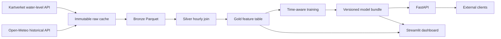

# Architecture

## System context

CoastCast turns public coastal and meteorological data into short-horizon water-level forecasts for Bergen. It is deliberately split into small services and durable analytical layers so that ingestion, transformation, modeling, and serving can evolve independently.



## Components

### Source clients

`coastcast.data.clients` contains one client for each provider. Requests are split into bounded time windows. Every response is cached by a hash of its complete request URL, which reduces provider load and makes reruns deterministic.

### Bronze layer

Bronze tables normalize provider-specific XML and JSON into columnar Parquet files. The water-level table is hourly and wide, with separate observed and astronomical tide values. The weather table retains the configured model grid coordinates for provenance.

### Silver layer

The silver table joins both sources on UTC timestamps and computes a consistent hourly analytical spine. Join coverage must exceed 90 percent. The delivered nine-year build contains 78,888 hours and achieved 100 percent coverage.

### Gold layer

The gold table adds the surge residual, directional wind components, time cycles, pressure tendencies, historical lags, rolling volatility, and future evaluation targets. Future target columns are excluded by name and type from the model feature list.

### Transformation paths

The main Python pipeline writes Parquet and DuckDB tables so it can run on a laptop without a separate database. The `transform` folder provides equivalent dbt staging, intermediate, and mart models with data tests. This allows the analytical layer to move to a managed warehouse without redesigning the domain model.

### Modeling

Each horizon has an independent gradient-boosted regressor and a persistence baseline. Champion selection pools four annual expanding-window validations from 2020 through 2023, with year-specific metrics retained. The selected estimator is refitted through 2023, calendar year 2024 calibrates uncertainty, and calendar year 2025 remains untouched until final evaluation. Horizon-length purges prevent labels from crossing split boundaries.

Uncertainty uses volatility-normalized split conformal calibration. The interval expands when recent surge volatility is high and contracts during stable periods. Monthly calibration groups add protection against a single calm month producing intervals that are too narrow.

### Serving

The model bundle contains feature order, model objects, selection results, calibration metadata, horizons, and data scope. Both the API and dashboard use the same `ForecastEngine`, preventing differences between batch and interactive inference.

### Orchestration

The Airflow DAG runs ingestion, transformation tests, training, and evaluation in order. Raw response caching, checksum verification, and atomic cache writes make retries idempotent. A failed task can be rerun without repeating successful provider downloads.

## Deployment boundaries

Docker Compose exposes the dashboard and API separately. Azure App Service hosts the public dashboard from an immutable container image in Azure Container Registry. Registry access uses a user-assigned managed identity, and HTTPS is enforced at the platform boundary. Data acquisition and training remain a scheduled or manually triggered pipeline, while the deployed image contains approved artifacts only.

## Storage layout

```text
data/raw/       provider responses and request metadata
data/bronze/    normalized source tables
data/silver/    joined hourly analytical data
data/gold/      features and evaluation targets
artifacts/      fitted models, signatures, metrics, and predictions
reports/        technical and generated evaluation reports
```

## Design tradeoffs

- Parquet and DuckDB keep the project reproducible on a laptop while preserving lakehouse patterns.
- Independent horizon models are easier to validate and operate than one opaque multi-output model.
- A simple model must beat persistence before it is deployed.
- The public application uses a frozen historical dataset. It does not silently mix later observations into evaluation.
